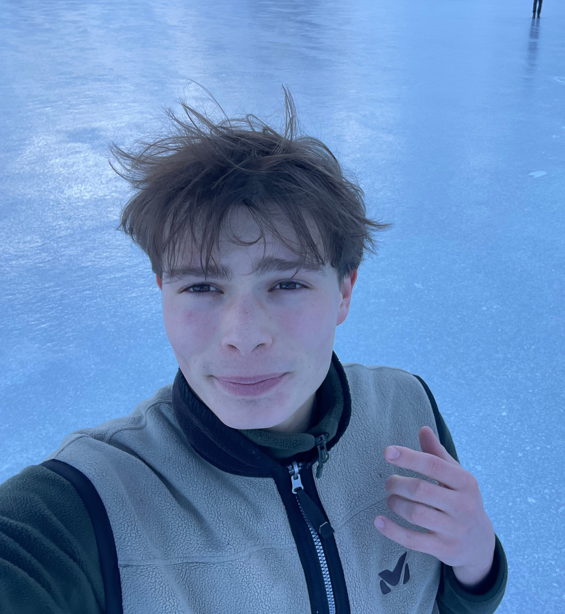

My name is Maxime, I'm an AI researcher working in Singapore (Genome Institute of Singapore).

Right now, I mostly work on DNA/RNA foundation models.

I'm open to PhD opportunities :) (starting in September 2027) so please do not hesitate to [contact me](https://mrochk.github.io/contact.html). 

***

[**GitHub**](https://github.com/mrochk) &nbsp; &nbsp; &nbsp; &nbsp;  [**Scholar**](https://scholar.google.com/citations?user=d8uMxiYAAAAJ) 

