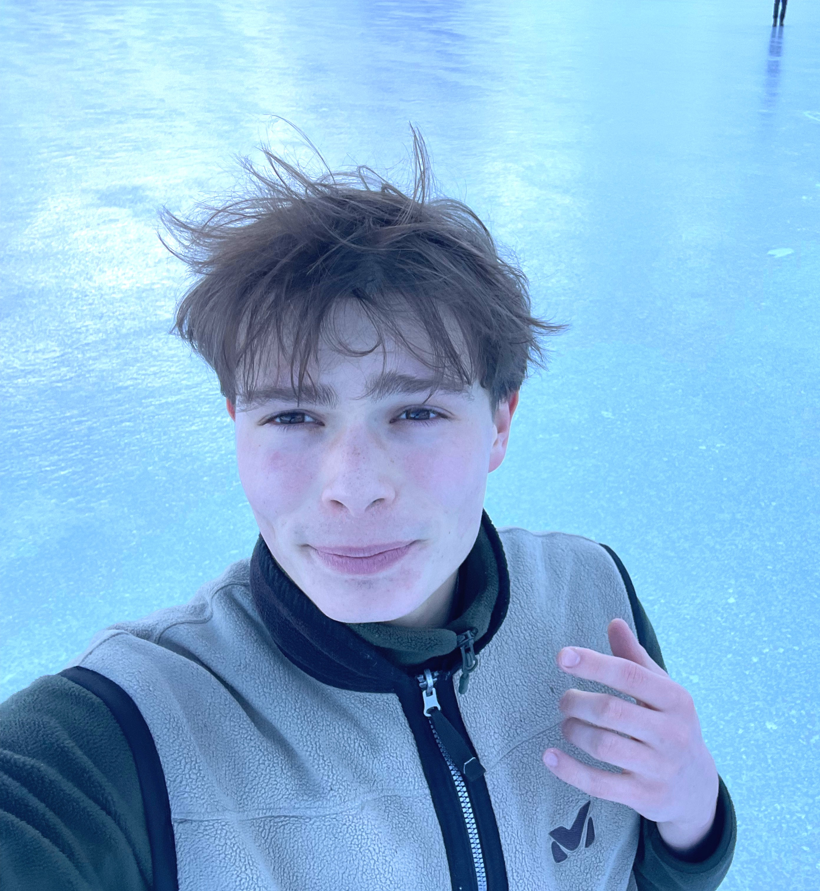

I'm Maxime, an AI researcher working in Singapore (Genome Institute of Singapore).

Before that, I obtained a masters in computer science from KU Leuven.

My interests in ML lie mainly in non-supervised approaches (self-supervised / reinforcement learning).

Currently, I primarily work on foundation models for genomics.

I am open to PhD opportunities (starting in September 2027) so please do not hesitate to [contact me](https://mrochk.github.io/contact.html). 

***

[**GitHub**](https://github.com/mrochk) &nbsp; &nbsp; &nbsp; &nbsp;  [**Scholar**](https://scholar.google.com/citations?user=d8uMxiYAAAAJ) 

***
