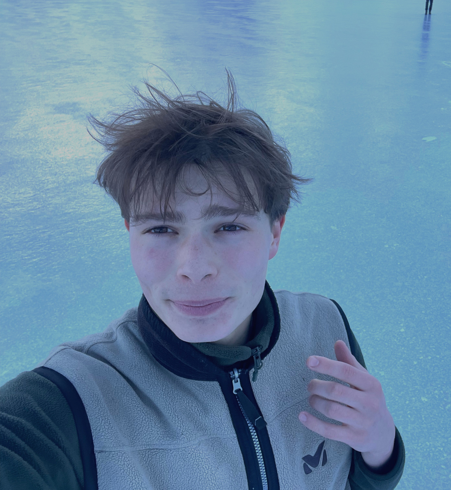

I'm Maxime, an AI researcher working in Singapore (Genome Institute of Singapore). I work mainly on problems related to RNA foundation models and structural biology.

Prior to that, I obtained my masters in computer science from KU Leuven.

More generally, my interests in machine learning lie in scalable, non-supervised approaches (such as SSL and RL), but also NeuroAI and mechanistic interpretability.

***

[**github**](https://github.com/mrochk) &nbsp; &nbsp; &nbsp; &nbsp; &nbsp; &nbsp;  [**scholar**](https://scholar.google.com/citations?user=d8uMxiYAAAAJ) &nbsp; &nbsp; &nbsp; &nbsp; &nbsp; &nbsp; [**blog**](https://mrochk.github.io/blog.html)

***

